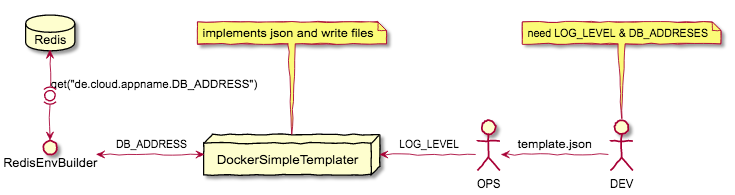

# DockerSimpleTemplater

Define needed Variables and replace Variables in Files on startup.
Filling Variables can come from boot (composition) or automaticly from a Keystore as redis.

### Installation
```
git clone https://github.com/dockermgeo/DockerSimpleTemplater
cd DockerSimpleTemplater
make
```

#### Dependencies
* jq

on
*  Ubuntu: apt get install -yq
*  Alpine: apk add -yq


### Using Docker-Simple-Templater

1. Define Jsonfile (Sets/Configurations)
2. Bind Templates
3. Call docker-templater

#### Command:
```
 /usr/local/bin/docker-simple-templater <jsonfile>
 or
 /usr/local/bin/docker-simple-keystoretemplater <jsonfile>
```


### Define JSON (Sets/Configurations)
JSON
```
[
 {
   "template":"/src/index.tpl.html',
   "target":"/usr/share/nginx/html/index.html",
   "set":[ "ENV_FIRSTNAME", "ENV_LASTNAME", "ENV_STREET", "DB_ADDRESS" ],
   "keystore":{
     "keyqualifier": "de.cloud.key_value_group_id",
     "group": "de.cloud.key_value_group_id",
     "superkey_command": "hostname"
   }
  },
  {....}
]
```
#### Simple Templatekeys for ***docker-simple-templater***
- **OBJECT**: Docker-Simple-Templater works on each Object. You can define any...
- **set**: Set of needed variables
- **template**: Templatefile
- **target**: Destination, in which Templatefile will copy and replaced all variables from set.

#### Objekt for accessing keystore for ***docker-simple-keystoretemplater***
- **group**: Group, Name or ID as PREFIX before variablename ("group.varname"). Depends by keystores!
- **superkey_command**: Command, who specify a Subgroup of group. Example: hostname


### Bind Template
Edit your Templatefile and set Variablename between "%%" at start and end of targetposition.
```
 < h1 >Hallo %%ENV_FIRSTNAME%%!< /h1 >
```

### Docker integration on boot
You can use docker-templater on Dockerbootstrap. Put this File into DockerBootstrap -up.d/.
More Info to [DockerBootstrap](https://github.com/dockermgeo/DockerBootstrap).




#### Snipplet from a Dockerfile
```
RUN apt-get update && apt-get install -qy git jq && cd /tmp && \
    git clone https://github.com/dockermgeo/DockerSimpleTemplater && \
    cd DockerSimpleTemplater && make install

# next: enabling loading from keystore
#ENV REDIS_HOST 192.1.168.32

#you can add json also as volume -v /tmp/myproject-app_template.json:/template.json
COPY src/app_template.json /template.json
```

### Processing with Keystores

#### Keystoresystems
A RedisKeystore-Dockerimage you'll find on Dockerhub "[dockermgeo/redisdb](https://hub.docker.com/r/dockermgeo/redisdb/)".
A Vault-Dockerimage you'll find on Dockerhub "[dockermgeo/vaultserver](https://hub.docker.com/r/dockermgeo/vaultserver/)".

#### Bring data into your keystore
Given are from JSON
  - keygroup=de.env.service.hellohttp
  - superkey=group+(hostname)

At first round **docker-simple-keystoretemplater** will ask for *superkey*
```
de.env.service.hellohttp.Pluto{"LOG_LEVEL":"DEBUG"}
```
before asking for *keygroup*
```
de.env.service.hellohttp{"LOG_LEVEL":"INFO"}
```
It's a simple fallbacklogic.

#### Other Ideas
Ask on specialtime the keystore. The build is a good point of time.
```
de.build.service.hellohttp{"LOG_LEVEL":"ERROR"}
```

Set special SETS for Releases
```
de.env.service.hellohttp{"TITLE":"Welcome!"}
de.env.service.hellohttp{"LOG_LEVEL":"ERROR"}
de.env.service.hellohttp.V10002{"CMD":"java -jar exampler_V10002.jar"}
de.env.service.hellohttp.V10002{"LOG_LEVEL":"INFO"}
de.env.service.hellohttp.V10003{"TITLE":"Welcome - It is a new Relase!"}
de.env.service.hellohttp.V10003{"CMD":"java -jar exampler_V10003.jar"}
de.env.service.hellohttp.V10003{"LOG_LEVEL":"DEBUG"}
```

## Cliks Tool for redis or vault
If you're using this Project with keystore, it's doesn't mattern if vault or redis.
Cliks will control it for you automaticly. Cliks using [vault](https://www.vaultproject.io/docs/commands/read-write.html) and a another Redis-Connector as [CliReds](https://github.com/dockermgeo/CliReds).

In case, we are using cliks (ClientKeystore) who are switching between by Address.

```
cliks set de.env.service.hellohttp.V10003 LOG_LEVEL DEBUG
```

### Configuration

#### Vault
```
Environment:
  - VAULT_ADDR=http://0.0.0.0:8200
  - VAULT_TOKEN=token123
```

#### Redis
```
Environment:
  - REDIS_ADDR=http://myredishost:6379
  - REDIS_PASSWORD=redispw123
```
